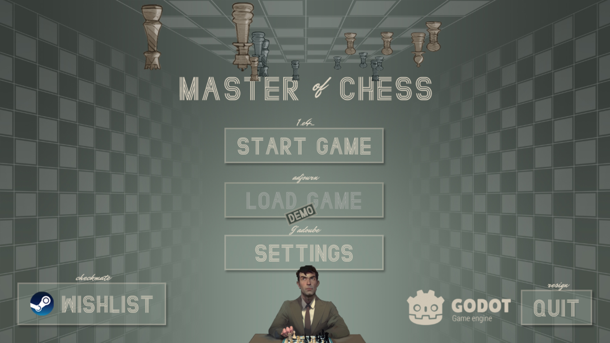

If you want to chat about the game, I created a **Discord** that I'm still not actively promoting anywhere, but there's few people with awesome ideas already there: https://discord.gg/HYV8Zz8V2Q

## Focus

In the previous progress log I outlined my plan for the demo of the game:

1.  You create your chess player
2.  **You go through small "How to play a match" tutorial**
3.  You enter a chess tournament and play it out
4.  If you do good you acquire Candidate Master (CM) norm.

And this week was all about number #2. I encountered a nasty bug in Godot (the game engine I am using for MoC) that totally crashed the game multiple times, and that wasn't much fun. In the end I managed to circumvent it and I do have bare-minimum **tutorial about playing a match**. Here's a short GIF:

Don't mind the weird numbers and confusing display, it's all to help me debug and to show what's going on under the hood. UI/UX is going to have a major rehaul before it goes in front of players. I hope the gif can also be useful to further **shine light on the way the game will be played**.

Another important thing I worked on in the past week is the main game start screen. It's still not as good as I wanted it to be but it's good enough, with an obvious reference to Netflix's hit show (and the biggest chess advertisement ever, probably) - Queen's Gambit:

## What's next?

Even though there's that bug that set me back and the tutorial isn't as good as I'd like it to be, it's time to set the tutorial aspect of the game away and **focus on the game loop**. This is the thing that makes or breaks the game so that's where I see myself spending the rest of March. It's mainly concerned by the #2 in my plan for creating a demo:

- **You enter a chess tournament and play it out**

The good thing is that most of the pieces are already implemented: the tournaments are there, the players are there, the match can be played. The bad thing is that everything is still too disjointed to get a proper feel of the game. **It's time to make things fun**!

## Additional Notes

- There was an awesome idea on my Discord from _J1ngleJ4ngle_ about incorporating Chess Hustlers in the game. I am seriously considering adding it in the game as it:
  - Can provide more fun characters
  - Can provide additional source of income for the chess player
  - Seems to be relatively easy to implement with current game mechanics
- There was an awesome idea on Discord from _osirf_ to have some kind of roadmap, I plan to dedicate some time for that too so players will have better understanding of where the game is and I'll recommit myself to finishing this game in due time.
