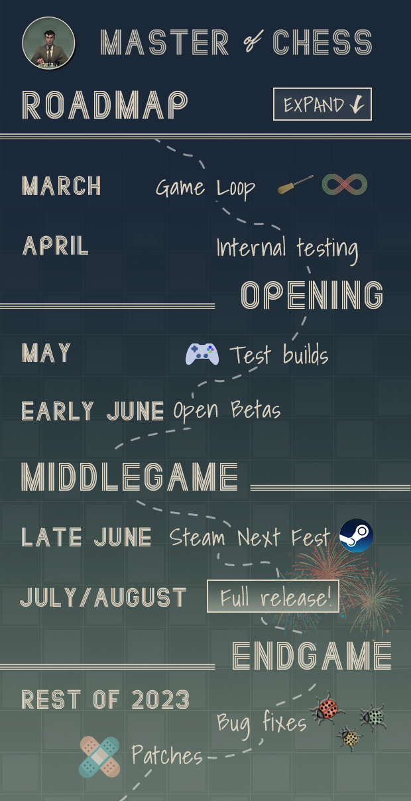

I had a great suggestion on my Discord to maybe create a Roadmap of the game. I created one this week because:

- The players would like to know when can they finally have their hands on this game and what it will take to get there
- It makes me question my plan for the game more and helps me scope it properly
- It reminds me of how much more things I need to do.

I've had couple of great ideas on that Discord but it's generally still a dead place because I got no idea how to run it and I'm usually too busy working on the game. If you still want to join, I do read and reply! - https://discord.gg/HYV8Zz8V2Q

# The roadmap

Picture says 1000 words so I am going to keep it short. This is my ideal trajectory for this awesome game I'm building. All players should keep in mind that:

- I work on this game before and after my regular 8h job. That's 1-4 hours per week day and 1-20 hours on weekends.
- This is my first commercial game
- I'm doing almost everything myself (I do ask my wife and a my gamedev best buddy Lorenzo for suggestions and I am pretty sure some awesome people will come and test the game when it's ready).
- Burnout can kick in at any time and this roadmap may be extended. I do my best to keep that from happening.
- Most of the time I have no idea what I'm doing

In all it's awesomeness I present the roadmap for Master of Chess, a game in which you guide a young chess prodigy from his first tournament to eternal chess glory!

