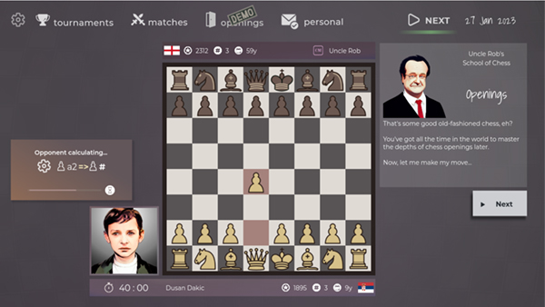

If you have questions about the game or you want more info, you can join the discord: https://discord.gg/HYV8Zz8V2Q

More than a month since last progress log. What was I up to?

## Tactics/Chess Puzzles Mechanic

With time my game is moving away from its managerial roots and **focusing more on the simulation** part. It seems that with every game design decision I make the player gets more hands-on approach.

That's why it seemed very fitting to introduce the mechanics of solving chess puzzles in order to get more Progress Points to improve your player. **It is different to solving chess puzzles on lichess or any other chess site.**

In the game, you use the 'Select one of the 4 possible moves' mechanic that is closely related to 'Candidate moves' mechanic of the chess matches in the game.

## Redesigns

Last progress log was all about how I added tutorial for the match. Now I know that was a stupid decision.

I basically redesigned the whole match experience and I'm now working on redesigning it even more. It is all connected to that notion of giving the player more of hands-on experience if he wishes so.

This is a big change in the way matches work. So I had to redo the tutorial all over again and I'll probably have to do it couple of times more! The whole tutorial system is now visually connected to the look of the puzzles window.

## Playtests

I've had other people than me play the game. It's very exciting! I worked on something for months not knowing if anyone will enjoy it (myself included).

It now seems there's a great probability someone will have fun with it! I got lots of feedback and I hope to squash most of the issues before I open the test builds of the demo for everyone. I plan to do it on _itch.io_ initially and expand to Steam later when I make the game more stable. My guess is that will happen in first part of May.

# What's next?

As mentioned, I am basically addressing issues that were found during playtests, some were obvious mistakes, some I am still not sure how to solve. They are mostly related to the way chess matches are played. Then the only remaining things to solve are some usability fixes and it's ready for public demo!
