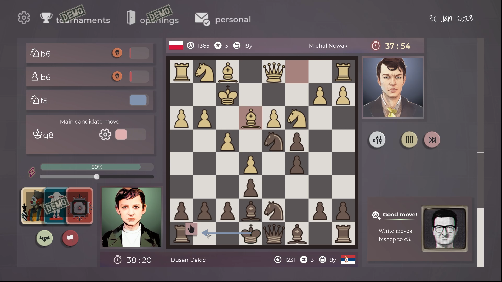

_What would a Football Manager game look like for chess?_

I started making this game with that question in mind. It looked simple enough in the beginning.

| Football Manager ⚽                    | Master of Chess 👑                                                 |
| -------------------------------------- | ------------------------------------------------------------------ |
| You manage your football team 👨‍👩‍👧‍👦       | You manage your player 🙍‍♂️                                          |
| You win leagues, cups and promotions🏆 | You win tournaments, get titles, and rise the ELO ratings ladder🔝 |

But the real attraction for managerial games comes from adjusting game mechanics for optimal gains. In FM you bring new players, adjust your tactics, develop young talents and you enjoy seeing them succeed and flourish under your expert guidance. What would equivalent of that be in **Master of Chess**?

You develop your in-game player skills in MoC, and your opening repertoire becomes richer as time passes. This is good but isn't deep enough to keep the player engaged. That's why I decided for a more hands-on approach.

**You play the moves on the board**, but your in-game character 'validates' them. The better the character is the more precise he is in his calculation.

In order to design proper match experience in the game I decided for following restrictions.

_All the matches in Master of Chess:_

- Must be winnable for players of any real-life chess strength against any of the in-game opponents
- Must be harder to win if your in-game character is weaker than opponent
- Must be considerably different to playing chess online
- **Must be fun**

### What affects match outcome

- Moves the player choses
- Player attributes (strategy, tactics and endgames)
- **Play intensity** of the player in the match
- Openings that are chosen (how familiar each of the players is with it)
- Element of **luck**/**randomness** like in any chess match

## What is play intensity?

- It is an in-match setting that can be adjusted
- If intensity is high, character calculation speed and precision increases
- But energy depletes faster if the intensity is greater
- When energy is low blunder possibility rises (precision degrades considerably)

These are the main pillars of the chess match experience.

On top of this the game then builds **tournaments**, **opening repertoire development**, getting chess titles, **solving chess puzzles** for faster improvement, getting prize money, having chess coaches and bunch of random events that happen throughout the game. You guide your player character through the chess world.

I think it's cool, and I enjoy developing it. Next week I plan to open up a demo to all the folks in Discord. If you're interested, join here: https://discord.gg/HYV8Zz8V2Q
