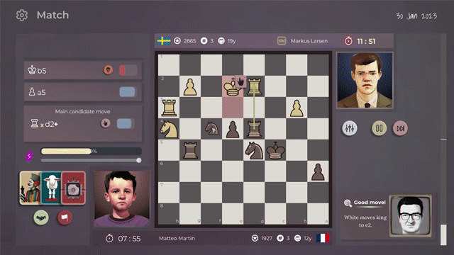

## What's happening with the game?

Last weekend I posted a short video announcement about Master of Chess Demo. It blew up on reddit, tripling amount of people on discord and doubling the wishlist count! 

Join discord here: https://discord.gg/HYV8Zz8V2Q as it had a big revamp by two community masters to which I'm extremely thankful:  **@Taxtibe and @Zokaper**

With all the new people that arrived there's been a lot more bugs reported, a lot more discussions about features and the look/feel of the game. At times I was overwhelmed but mostly I was extremely happy. 

I'm happy because I'm finally sure: I'm not crazy. This game has real appeal to people who love chess as much as I do and I'm right in trying my best to deliver an awesome chess simulation game.

### Enough with the pep talk. What's going on with the game? 

- Full focus is on fixing bugs and adding some UX niceties.
- I'm testing and figuring out the issues of the demo on Steam (it's still crashing fairly often)
- I'm updating to version 4.1 of Godot engine because it might resolve some of the bugs (and hopefully not introduce new bugs)
- I'm adding the Create your player screen and ditching the precreated campaigns

## What's the plan for the future
- Stabilize the demo (eradicate crashes)
- Fix more bugs
- **Release a new demo build on itch.io next week**
- Prepare a linux build (I am hoping this will give me more insight into why the game crashes, I'm still not sure!)

This gamedev journey was and continues to be a great ride! Cheers!