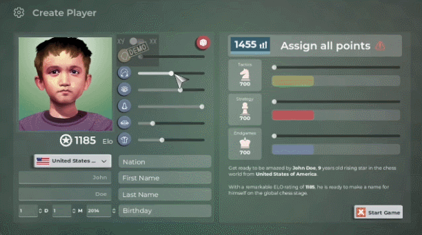

Today I've uploaded a new build of Master of Chess demo. If you're interested in testing it, join discord here: https://discord.gg/HYV8Zz8V2Q

This build marks a great point in development: **Demo is feature complete**.

Is it perfect? No. Is it bug-free? No way. But it's a valid reference point to what the demo will look like when it hits Steam. 

## The Latest and Greatest: What's New in the Demo?

- **Create your player** feature is integrated completely. Feel free to start up the demo and create your own player.
- **Match preview screen** got a complete overwrite. The placeholder UI is now replaced with a full overview of both players strengths and winning percentages.
- **'Game crashes randomly'** bug fixed! (or so I hope, I can't reproduce it any more!) It seems to be related to the way async code was handled in Godot and in the newest version 4.1 I had to switch the way async code is handled and even clear out some of the async logic.
- As mentioned, **game is now migrated to beta version of Godot 4.1**. We're running it bleeding edge as far as Godot is concerned. I'm really happy that Godot will hit stable 4.1 in the approximately same time as my game starts seeking stability too.
- **A linux build!** I decided to have a linux build because a) people asked for it, b) I hoped it would give me more insights into some game-crashing bugs. 
- Numerous little bug fixes and tidy ups. I plan to write this up in a more professional manner in the future so I can list those out easily. 

## A Few Dragons Still to Slay: Current Issues

 - **Chess AI Improvements:** Chess AI received a lot of comments, with some finding it too challenging and others finding it not challenging enough. This feedback isn't contradictory; it points to the inconsistencies in the AI, which I'm aware of. Over the next week (and even month), refining the AI will be a major focus of my work.
- **Enhancing User Interface:** The user experience on the match review screen isn't the best. Navigating through a completed match should be a breeze, and I agree that there's room for improvement. I'm committed to making this experience better. Some UX issues, bugs still exist on the main match screen too. These need to be addressed.
- **AI Responsiveness Issues:** Some of you have encountered a problem where the AI stops making moves. This was an issue I tackled in early builds, but it seems to have reappeared. It's time I dive into it and ensure it's permanently fixed.

## What's next?

As mentioned, the Demo is feature complete and all that's left is to polish it up. If I could get the AI to be decent enough in the next week and add some Quality of Life improvements then all would be ready for a Steam release of the Demo in early July.

I'm so excited!

