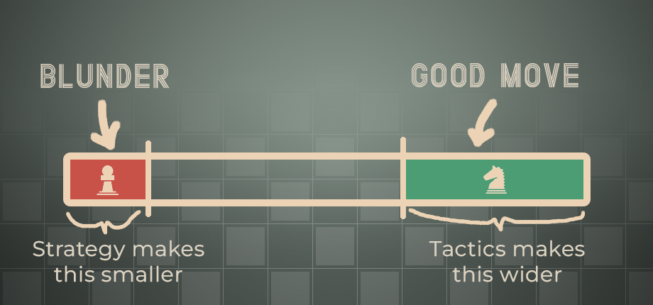

# Behind the Scenes of Master of Chess: Decoding the AI

As I plan to tackle the issue of badly balanced AI difficulty this week, it's a good time to do a write-up of how AI works right now. It will probably help me and some people might find it interesting too.

## When I started, what problems I had to solve? 

Firstly, AI had to know how to play chess. I used an existing strong engine for this, named Arasan. It's not Stockfish but it's closest to it in strength (Arasan is rated 3419 ELO at the time of the writing. https://ccrl.chessdom.com/ccrl/4040/) while being under MIT license (that allows me to sell the game). 

Now comes the hard part, the AI strength must be scalable in some way so the game makes any sense. This isn't that hard to do actually, you just select non-optimal moves here and there. The real complexity emerged when I attempted to correlate the AI's non-optimal move selection with the player character's abilities. At present, **Master of Chess** features two primary skills, **Strategy** and **Tactics**, that players need to improve as they progress through the game.

## How do Tactics/Strategy influence this 'non-optimal move selection'?

To answer this question I have to introduce few more concepts. 

- First off, we have **Evaluation**. Every move produced by Arasan comes with an evaluation, represented by a number denoting how many centipawns the current player is ahead or behind the opponent. To put it simply, an evaluation of 0 cp (centipawns) signifies a balanced position, while an evaluation of 1000cp implies the player making the move is a queen and a pawn ahead.
- Now, let's introduce **Player's Evaluation**. This value is essentially the sum of Arasan's evaluation and a semi-random figure, which I call **Variance**. The Variance is integral to the AI, influencing the eventual player's evaluation value that's displayed on the screen.
- **How is variance calculated?** Well, that's where Tactics/Strategy skills come into play. Each move the player plays, there's a possibility he will blunder or make a good move. A high Tactics skill increases the odds of the player making a good move, while a high Strategy skill reduces the likelihood of blunders. To illustrate these dynamics, I've created the following diagram:
  
- On every turn, red and green surfaces are calculated based on given players characteristics and a random point on the line is selected.
- After spot is selected, based on the position it ends up, variance is calculated. Blunder would mean huge variance, good move would mean very small variance.

## Example

If you managed to read thus far, it is probably quite confusing. So let's go through a scenario.

It's White to play and he's pretty bad. This means his red/blunder surface on the graph above is big, and green surface is small. We randomly pick a spot on the line and it falls on the red/blunder surface. ❌

As mentioned, every move that Arasan feeds to AI gets it's own Player's Evaluation value. Landing in the blunder region means that the variance value is high, which in turn results in a considerable discrepancy between the Player's Evaluation (which is Arasan Evaluation + variance) and the real evaluation. Because of this player's character has wrong idea about the given position and he (probably) makes a mistake. Not always though. Even though the variance is huge, just by sheer luck the semi-randomized Player's Evaluation can end up quite close to the real evaluation. 

⏱️ - Also, as the player **spends time** in the given position, Player's evaluation gets closer and closer to the 'objective' Arasan evaluation. I believe this fast convergence is one of the primary issues with the current AI implementation - it ends up making the AI play too accurately even at lower strengths. 

## Conclusion

I hope it made at least a little bit sense. When I started the game, my mission statement when designing the matches was:
- Must be winnable for players of any real-life chess strength against any of the in-game opponents
- Winning should be more challenging if your in-game player is weaker than the opponent.
-  The experience should be considerably different than playing chess online.
- Above all, it **must be fun**.

I think this implementation fits the statement quite nicely. It also allows the in-game attributes to affect the overall match quality which had to be there for the game to make sense. I'm not happy with how this is communicated to the player yet, but that's a different discussion.

As I continue to refine and improve the game, your feedback and questions are invaluable. Catch me on Discord: [https://discord.gg/HYV8Zz8V2Q](https://discord.gg/HYV8Zz8V2Q).  Let's make chess fun for everyone!
