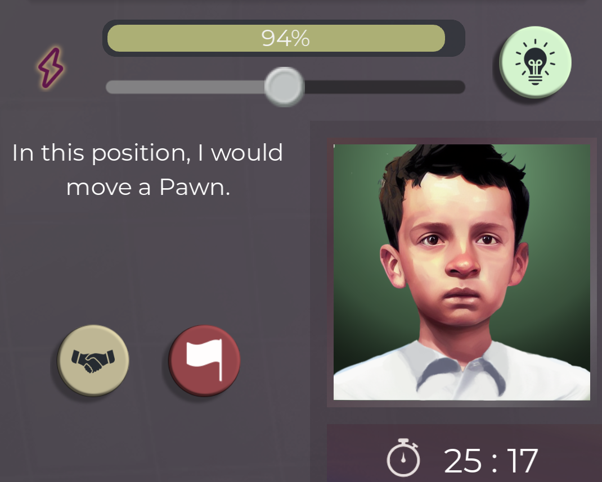
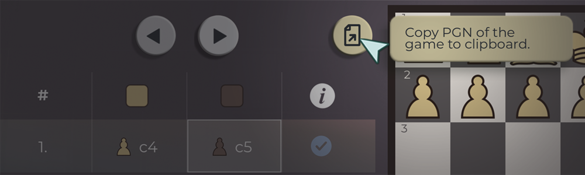

The latest version of the Demo is out. It's 0.0.7 time, baby!

I planned for this to be the last 'hidden' build before I move the demo to Steam.

I've had absolutely amazing feedback from a lot of players and that makes me truly happy, but you can't make a great game if all you have are praises. **That's why I want to get as much critique as possible**.

Join my discord to give me your worst opinion about the game: [https://discord.gg/HYV8Zz8V2Q](https://discord.gg/HYV8Zz8V2Q).

## The Critique

1. What sucks the most?
2. What is the one feature that is really missing from the game that you really need?
3. What's the one feature that is there but it just shouldn't be there or is so poorly implemented it's driving you crazy.
4. What looks totally out of place?
5. What made you quit the game in anger while slamming your hand on the keyboard?

If you have answer to any of these questions post it on Steam community, post it on Discord, hit me on Twitter, Reddit, it doesn't matter. I'll get to it eventually. I'm not promising I'll change anything, but I can promise you I'll read it and take it into account while developing this game. And I also promise you I won't take it personal, so please do your worst!

## New features

New demo build brings some new features, some long awaited improvements (and also some deletions, but if no one notices it's like they were never really there).

### Tip mechanism

This s a feature that will change a lot about how the match played. For players that played the game before the change I'd really like to know if they consider it a step into right direction. Get a tip about your move and lose some energy as the result. It's simple and I think a quite good addition to the match experience. **Let me know your thoughts!**

I think it needs a little bit of balancing and nuance but it really changed the gameplay for the better.

### Export PGN

A small but handy improvement, based on feedback I got on Discord (I can't find who reported it, sorry!). Click on the export PGN button and it will copy the PGN content to your clipboard.

## Improvements

- **Most of the time was spent on fixing and upgrading the AI.** I think it's a lot better (realistic) now but it's probably still to strong for my liking. Let me know if it's any better!
- Create player screen got some love too. You can decrease your ELO now, and maximum ELO is only defined by players year of birth, not his selected month and day.
- **Added Scotland, Wales and China**
- Some blurry sprites have been improved (while not all of them are extinguished, but I have a great list compiled by my discord community master - Zokaper)
- Cursor has been changed and is more responsive (meaning it changes colors when he is over something interactable)

And many little ones that people probably do not care about that much.

## What's next?

It's getting closer to the day I release the demo on Steam. Last time I tested it via Steam launcher it crashed only couple of seconds after I started! I hope that won't be the case any more.

So in order to do that I wanted to tidy up all the assets I have around marketing. Go and check which streamers, youtubers and bloggers I can contact about my game and try to fix a few nasty bugs that remained.

So in about two weeks (a little less I hope), when another blog drops here, I hope it will be from a guy that has a demo released on Steam. It's a big thing for me!

Thanks for reading and I'm looking forward to your opinions. Let's make chess fun for everyone!
