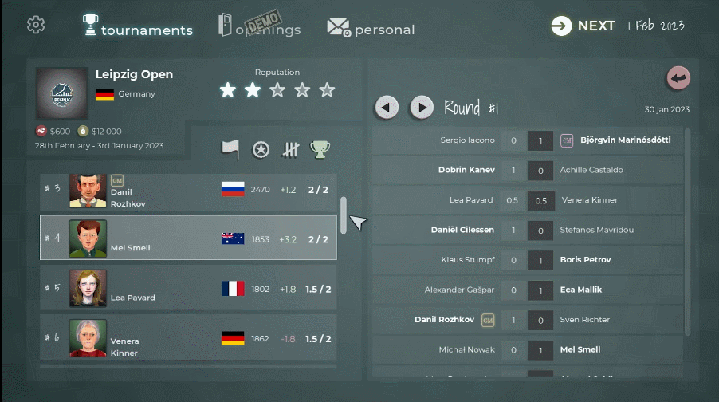

We're one step away from the demo finally being on Steam. The new build is 0.0.8 and it's awesome.

The demo drops on **26th** **July** on Steam. Set those reminders!

If you can't wait to get your hands on it, there's an early build ready. Join the discord to get it or if you want to have a chat:[https://discord.gg/HYV8Zz8V2Q](https://discord.gg/HYV8Zz8V2Q).

## The New build

I'm guessing most of the people interested in reading this already have tried the demo out. If you're one of those and want to know if you should refresh your experience, here's what is new:

- Added time increment logic (Fisher time). Not having enough time shouldn't be a problem any more.
- The sliders have been redesigned. I know it sounds trivial but it was a nightmare and I'm so happy with the improvement.
- Upgraded the display of moves on match screen, making it easier and prettier to follow the match
- Added more tooltips on the Tournament and Match Result screens for that extra bit of insight.
- Squashed a bug messing with the move line color on the board. It's a cleaner, bug-free experience!
- Many other smaller tidy ups that bring the game closer to what I have in mind
- I also again degraded the AI experience, it's again too strong. But I hope to get to the bottom of it soon enough.

## What's next?

The Steam release of course! Demo will be out on 26th of July, Wednesday. I'm excited, slightly nervous and full of expectations. I hope it goes well and gets some new players with fresh feedback.

You'll here from me again in three days. In the meantime, try out the demo and let me know what you think. Let's make chess fun for everyone!
