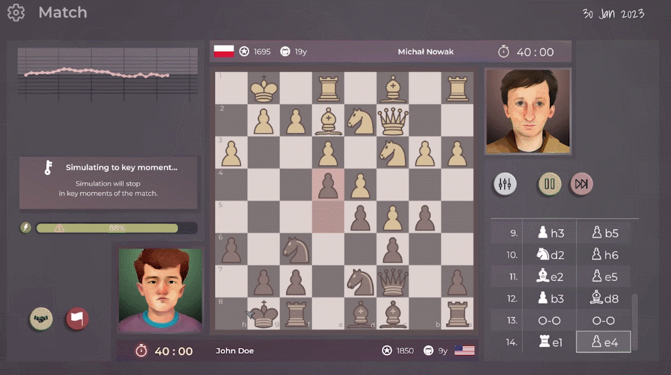

The biggest update to the game since the day I opened it to the testers is here! Try it out on Steam or itch.

Join the discord to give me some feedback:[https://discord.gg/HYV8Zz8V2Q](https://discord.gg/HYV8Zz8V2Q).
Every bit of information helps!

## The New build

Version 0.2.1 is out!

It includes:

- 🔑 Amazing new feature **Key Moments Simulation**: let your character play all the moves except crucial moments in the game

- 🧩 **Total rewrite of Puzzles Training** feature: It's fast, it's bug free (prove me wrong! :P), there's 10 Puzzles to solve now. There's puzzle streaks to accomplish.

- 👨 Total **redesign of Create Player Screen**: again enjoy in selecting the skills of your player and even the most requested feature of having the male character with long hair is there.

- ✉ Personal screen looks completely different too

- 🖼 Probably **every part of the game got a little bit of love**, an animation here, a colorful icon there - it is all going towards a unified vision I have for the game.

## What's next?

I started work on the Openings feature (the cool graph you can see in the game screenshots). It's the last big feature that I plan to add to the game.
I'll also look into improving and fixing smaller bugs on the demo before it reaches Steam Next fest.
