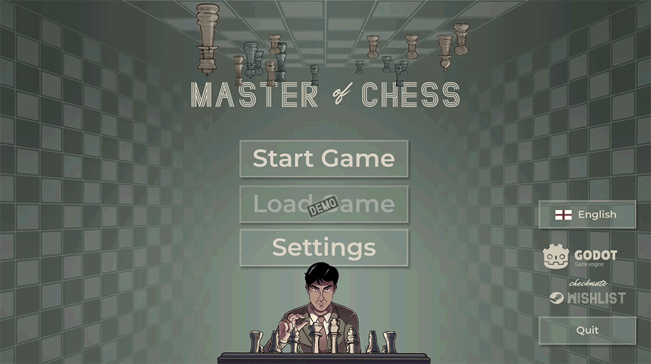

Heya! By this time next week there's going to be a new version of the Demo out.

What's great about it? The game will be translated in couple of languages! MoC community stepped in and it seems we'll have the game translated to (at least) Russian, Polish, Swedish, Portuguese, French, Serbian, Vietnamese and German!

# Join the party

If you want to improve the existing translations or you'd like to contribute your own language join us on our discord [https://discord.gg/HYV8Zz8V2Q](https://discord.gg/HYV8Zz8V2Q).

# What's next

1️⃣ As mentioned I plan to update the demo one more time before Steam Next Fest. It's a big event for me and for the game. We're both first time there.

🖼 So there's many improvements to UI/UX to make the game cool for the new folks.

But talk is cheap, I'll go back to working on the game and I hope you'll be there next week to test it out on your own.

Let's make chess fun for everyone!

BRANE
