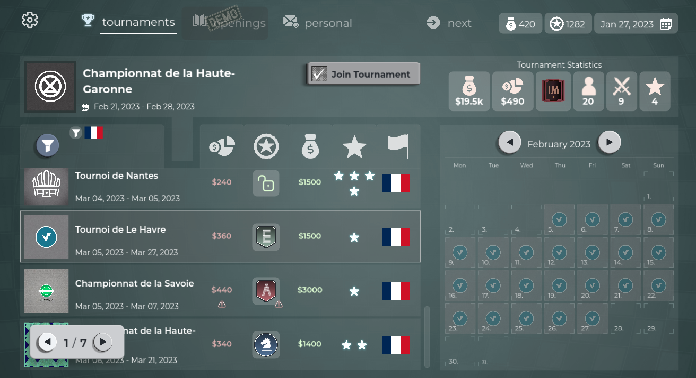

Steam Next Fest is long gone and it was an amazing ride!

- ✅ Hundreds of new wishlists (**wishlist the game if you haven't!**) 
- 🎥 1600+ people at one point watching me stream the game 
- 📢 Amazing feedback from the new players

Join discord here: https://discord.gg/HYV8Zz8V2Q to get daily updates on the game and provide your feedback!

# What next?

With that wind in my sails it is time to work on getting this game over the finish line. I worked past two weeks on creating the tournament experience. Couple of thousands tournaments later, I'm quite happy with the way it turned out (it will get a lot better after players get their hands on it) 

So even though tournaments do need more love, **I'll focus on the Match AI next** as that was the biggest pain that the players experienced. After this work, I hope ELO will reflect more the strength of the AI you're facing. 

**At that point I'll release the new and last (I hope) version of the Demo.**

From that point onwards all my efforts will be to get an early build of the full game out. This means finally adding the Openings feature, Finances management, redoing all the avatars in game, balancing the progression, fixing bugs (and those that I introduce on the way) and adding couple more smaller features.

All in all, it's exciting time for the game and I'm really happy with the way things are going.
Let's make chess fun for everyone!

