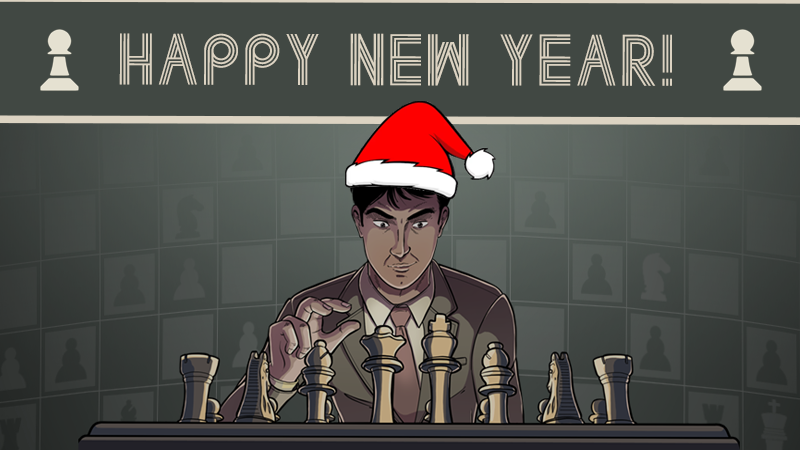

Heya!
It's 2024. It's the year Master of Chess gets released.

Safe to say I'm really excited for this year and my projects. If you're not visiting here often you might be wondering what's the latest state of the game. So here it is:

## The Plan

- I'm working on a **FREE** chess app about Chess Openings that I've extracted away from Master of Chess. It's called **Chess Opening Repertoire Builder** (CORB) and I plan to release it in February. It's my way of saying thank you to the chess community while simultanously getting experience with releasing games on Steam.
- I'm upgrading the Demo. The newest update doesn't bring many new improvements but is more focused on polishing the existing experience. Expect an update in January.
- I'm preparing first alpha build of Master of Chess which I'll release on Itch.io. It's the biggest milestone of the game and I'll do my best to deliver it this month. This work is on hold right now because of some workstation issues but I should continue working on it soon.

Big thanks to everyone that have reached out and gave me their piece of mind. It's of great help in shaping this game. I'm loving it, I'm excited for what future holds. Lets stop the blunders! 

BRANE