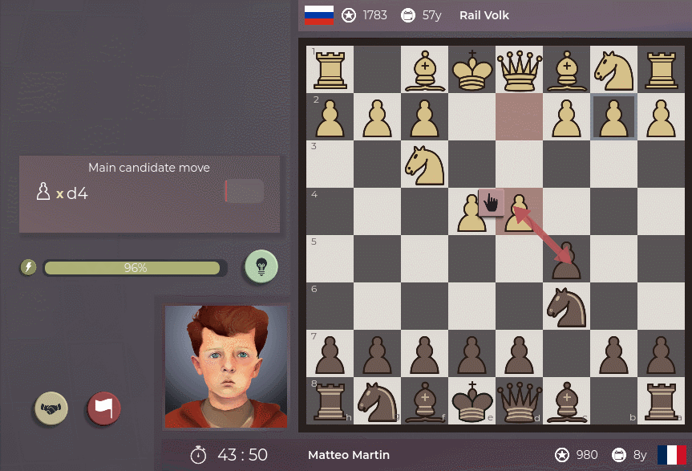

**It's 2024, it's the year MoC comes out.** And if everything goes well it should be out in couple of months. It's weird writing those words when there's so much more to do, but I'm excited for it. Future is bright!

If you want to talk chess or game development, join here: [https://discord.gg/HYV8Zz8V2Q](https://discord.gg/HYV8Zz8V2Q).

# What's new?

It's been so long since last demo version that it's hard for me to list out what has changed. Better question would be: what hasn't!? You'll find threats detection feature (you'll know it when you see it), a much improved AI, more polished UI, improvements in UX, more translations. **Everything changed.** (for the better, I hope!)

# What's gone?

I've added as much as I've removed to deliver a more focused and polished version of the demo.
So the demo no longer contains:

- 📰 Separate Tutorial screen. It's now built in the first match.
- 🤵 Player creation process. I wanted to let the player see the game in action as soon as possible. You're immediately presented with pre-created player from France - Matteo Martin.
- 🔑 Key Moments simulation. I don't have good explanation why, it just was too buggy after I added many AI improvements in the game and I decided to cut it out for a moment.

# What's the plan?

There's two threads I'm trying to follow.

First and foremost I'm looking into creating an alpha build of MoC. There's plenty of work to do, but I think I'm getting close. It will be rough, but it will be first real insight into the full game.

Secondly, **I'm working on releasing a completely free app about chess opening repertoire creation**. When folks saw the opening graph screenshots, a lot of comments were about how they would be interested in something like that, even if it was standalone. Now they can have it!

So a lot more work left. Check out the new demo and let me know what you think!

Heya! By this time next week there's going to be a new version of the Demo out.

What's great about it? The game will be translated in couple of languages! MoC community stepped in and it seems we'll have the game translated to (at least) Russian, Polish, Swedish, Portuguese, French, Serbian, Vietnamese and German!
