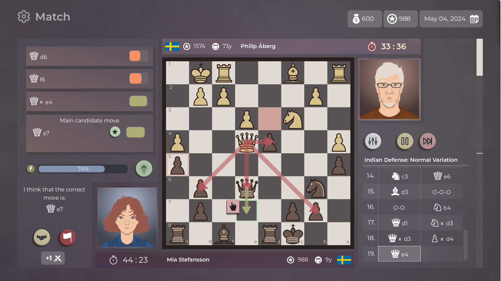
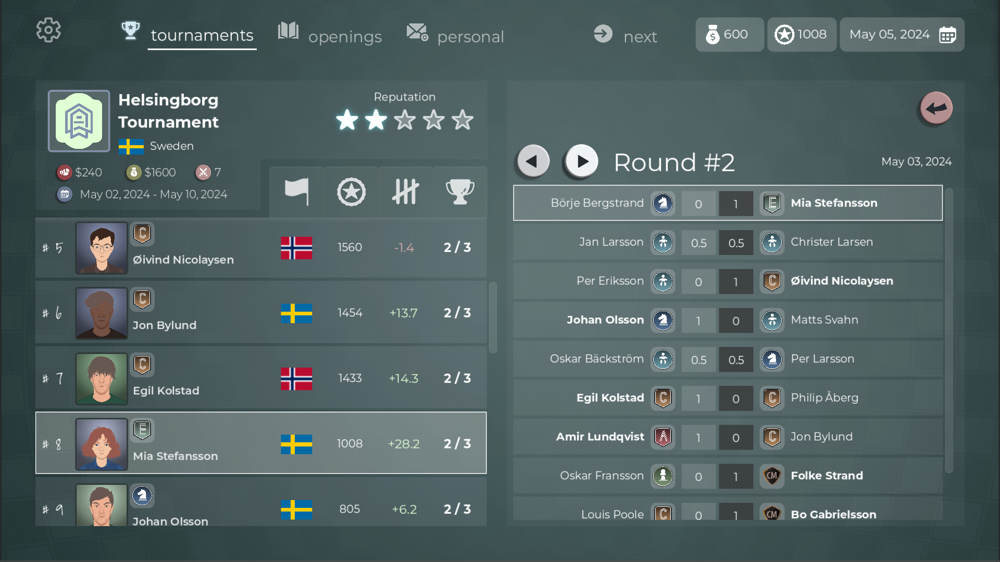

**A new demo version is out!** While most of my and community's efforts go into testing and improving the alpha version of the game, I had to move some of that improvements back into the demo version of the game.

If you want to join the community or check out the alpha join here: [https://discord.gg/HYV8Zz8V2Q](https://discord.gg/HYV8Zz8V2Q).

# What happened?

- 🤵 All previous avatar sprites were removed. With help from my talented friend Lorenzo, we updated all of the avatars in the game. Aging of characters finally makes sense.
- Many QOL improvements were added like threat detection, material count, promotion etc.
- Numerous bugs were squashed

# What's next?
- I'm working on the alpha version of the game non-stop. Community at discord is hard at work finding and reporting numerous improvements/bugs
- I've added a lot of logic around tournaments and looking into creating save games next
- This amazing work around avatars wouldn't be complete if I wouldn't return the Player creation screen

# Last but not least

Have I mentioned that my **free** Opening Repertoire app is available on Steam? https://store.steampowered.com/app/2755460/Chess_Opening_Repertoire_Builder

I'm improving it from time to time, but Master of Chess is where most of the efforts go. Take a look at it if you're interested in chess openings.
