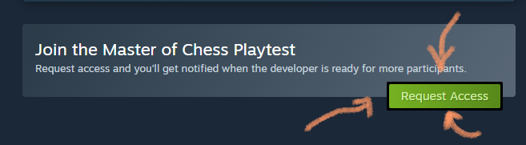

### Test out Master of Chess!

It's been a long loooong trip and the rocky part is yet to come. Early access release is coming very soon (I'll drop the announcement at the end of May). That's why I need your help (*insert 'once more I'm asking for your support' meme) to test out Master of Chess.

## Known problems

- The progress of your player character is not balanced and it's what I'm working on right now. He progresses too fast, with some playtesters having World Champion players younger than 17 (try to beat that, Gukesh!)
- Knockout tournament doesn't simulate properly with skipping rounds. (I already fixed this one, and will be part of next release)
- Names generation totally wrong for some countries
- Trophies rendering wrongly when the room is full
- Some minor issues with tournament qualification logic

## Your tasks

To have fun with the game as much as possible! And to report whenever the game didn't allow you to. Things like:

- Obvious game-crashing bugs
- Minor grievances when the game makes something you want to do hard for no good reason
- Unusual slowness and poor optimization

## My plan

I must fix the problems I listed and also those that will be reported in the meantime. I also want to conjure up some kind of marketing campaign but obviously I don't know how. If you **know a streamer** that could be interested in streaming the game let me/them know!