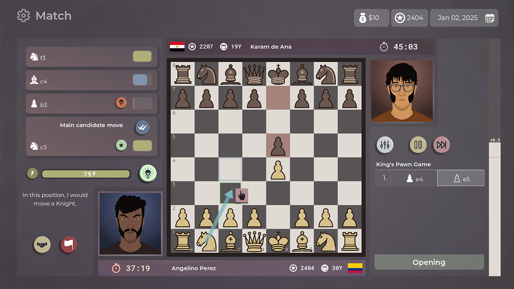

The Chess World Championship Match is just around the corner. Chess world is buzzing! I'm rooting for Ding. I love a good comeback story.

# New Master of Chess build

The work on the game doesn't stop. Just in time to get that Chess World Champion title before the match. This build has the most significant amount of changes I made ever since I released to Early Access. Most of it might not be visible to you but the game is now completely different under the 'facade'.

I've been listening to you and tried to implement as much as possible. You can always reach me on discord: [https://discord.gg/HYV8Zz8V2Q](https://discord.gg/HYV8Zz8V2Q) to give your suggestions.

Here's a list of changes:

- 🦎 **Switch to Lizard chess engine!**
- 💻 Improve the AI.
- 🆕 Add Buchholz system for Swiss tournaments.
- 🎨 Add colorful line drawing on the board. (hold shift/CTRL)
- 🐛 Fix bug with board flipping in analysis screen.
- ➡️ Add full move continuations in analysis screens.
- 🎨 Improve look of match simulation modal.
- 🔄 Improve Swiss pairing.
- 🐛 Fix bug with tournament population that excluded the player's entry.
- 🕰️ Fix bug with game breaking after time runs out in a match.
- 🔧 Refactor energy usage.
- ⏰ Add 'Get a job' event for broke adults 😅

## Switch to Lizard engine?

It's a big change. The game is now integrated with the powerful **Lizard engine**. Lizard is MIT licensed and written in C#. Perfect.

> Lizard's CCRL Blitz Elo is **3749**, around 70 points below the almighty Stockfish. (source: https://www.computerchess.org.uk/ccrl/404)

The game doesn't use UCI protocol anymore, enabling it to run in only one process. At first glance, it might seem like a step backward. You can't easily replace the engine with another chess engine (Stockfish, Leela...) now. But it was never my intention to allow this. It can always be implemented for the analysis part of the match, though!

## Improving the AI

It was a perfect time to look into this. I've tried my best to reduce the number of 'stupid' moves - the ones where you capture a piece but AI just ignores it and does not recapture. It's not perfect yet but I think it got a lot better. I've used Lichess as a playground for my bots in order to calibrate the strength. Lichess has been immensely helpful throughout MoC's development.

## Breaking saves

As I said, I've changed a lot of things! It's only fair I warn you: your saves might be corrupted now. I say 'might' because I'm not sure. I've not taken significant measures to ensure backwards compatibility so it could be a rough transition. Be warned!

## The big bucks

> ⚠ Price increase from 0.8.x -> **$19.99** ⚠

0.7.x is the last iteration of Master of Chess with base price of $14.99. **From 0.8.x it's going up to $19.99.** The game is growing and maturing. The value of it is increasing and I'm feeling more and more confident with each new build. It's worth that much and I'm ready to flip the switch.

But hey, you don’t care—you already bought the game, right? 😋

## What's next?

After I clear out all the bugs introduced by 0.7.x, I'll continue improving MoC. For 0.8.x the plan is to add:

- Coaches
- **Improve openings**
- Exhibition Matches
  Openings were always a thorn in my backside from game design perspective. I butchered it a lot. Time to give it some love.

In the meantime I might go back to Demo and polish it up. It's heavily out of sync with the base game. Might give people bad first impression.

Thanks for reading. If you haven't already, give Master of Chess a try. :)

Cheers!
